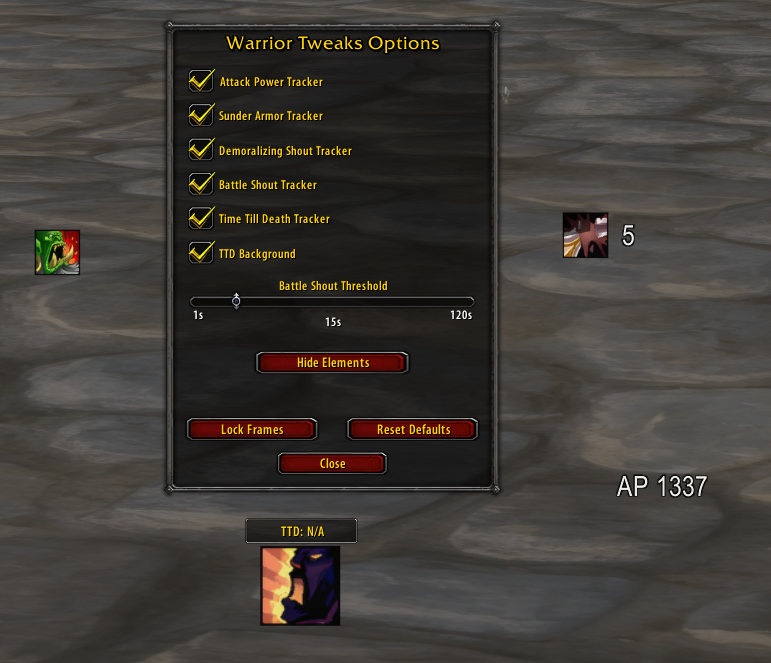

# WarriorTweaks

Warrior Tweaks is a lightweight UI Addon designed to help Warriors manage their most important abilities and debuffs in combat. For all features you need superWoW.

## Featurelist:

- In-Game GUI & Test Mode: Type /wt to open the configuration panel.
- Sunder Armor Tracker
- Demoralizing Shout Tracker
- Battle Shout Reminder: Shows an icon and a cooldown spiral when your buff is about to fade. The time threshold for the reminder is fully customizable (1 - 120 seconds).
- Attack Power / Execute calculation: Calculates when to use what for max damage.

##Commands:
- /wt - Opens the configuration GUI.

### The moveable frames in game:  
 

Based on melbaas "apd" Addon
